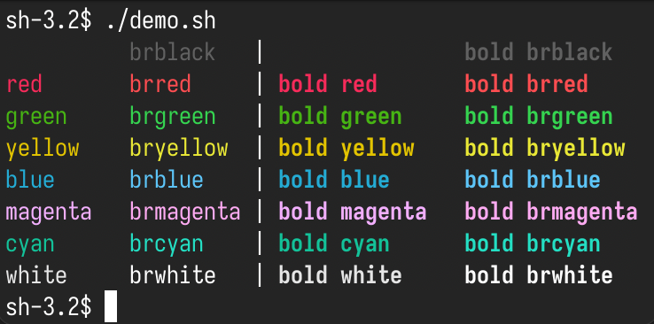

# Starlight
Starlight is an ansi color theme focused on usability.

It was made after I made the discovery[^1] that I have a color perception deficiency: I have trouble differentiating between hues of blue (a greater one than the average person, making it impossible for me to read typical default blue text on black backgrounds).
I also have a mild deficiency along the same lines for red, but not nearly as bad.
I set out to make a high contrast theme that would work for me (a non-normative survey helped discover that some others have no issues with this content, while a few others do still struggle, but due to not struggling as much as I do, they simply live with it).
[^1]: I now have an actual diagnosis: tritanomaly. It's sufficiently rare that health professionals where I live do not screen for it when checking for colorblindness.

This repository is me sharing it.

You can find the exact rgb data in `colors/colors.sh`.
Other files inside of `colors/*.sh` are generators for various applications I use.
The goal is for me to only need to modify `colors/colors.sh` and the explanation/implementation section whenever I make adjustments.

## Screenshots

## Goals
* All base colors (black, red, green, yellow, blue, magenta, cyan, white) should be easily uniquely identifiable.
* Bright variants should be identifiable side by side, but do not need to be uniquely identifiable.
* Text in any color (except black) should be legible on the black, even when not bold.

See the [CHANGELOG](CHANGELOG.md) to see implementation details.

## As Template
A lot of the tooling present is usable as a template for other ansi color schemes.
To use it this way, modify `colors.sh` and set your own colors, re-using all of the other scripts as-is.
Don't forget to add a screenshot to `data/` and modify the README!
